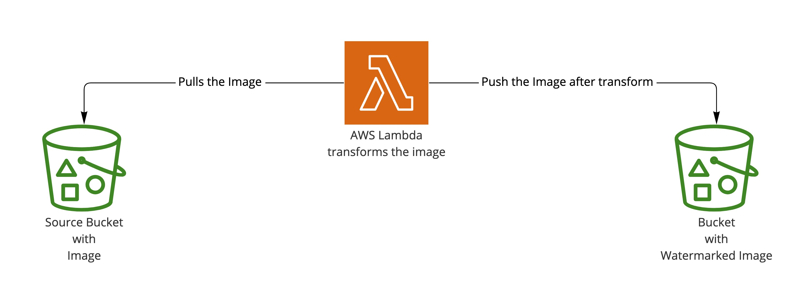

# Convert Image uploaded with watermark

## Architecture
  
  
  - Source Image is uploaded to S3
  - Triggers AWS lambda, which converts to watermarked image
  - Store Watermarked Image to Destination S3

